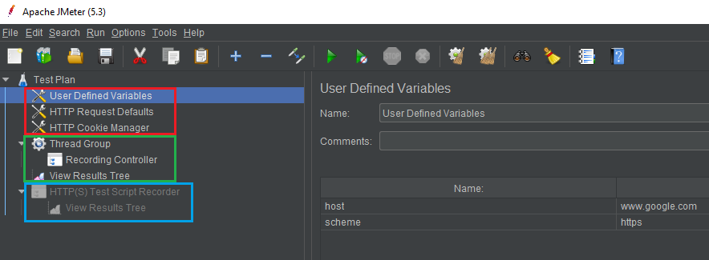

กลับมาตามคำสัญญา ภาค 2 ของ JMeter: Performance Testing Tool วันนี้เราจะมารุมยำ server ว่าจะไหวไปสักกี่น้ำ แต่ก่อนจะกระหนำยิง เราต้องมีรูปแบบการใช้งานที่สมจริงเป็นต้นแบบซะก่อน

## เนื้อหาในบทความ

1. [บันทึกการเดินทางด้วย Recording Template](#recording)
2. ปรับแต่ง Thread Group
3. Run Test Plan.jmx
4. ดูผลลัพท์

## นี่คือการเล่นจริง เจ็บจริง ไม่ใช้แสตนด์อิน ไม่ใช้ตัวแสดงแทน

*การทดลองมีความเสี่ยง ผู้ทดลองโปรดใช้วิจารณญาณในการรับชม*

----

## <a name="recording">บันทึกการเดินทางด้วย Recording Template</a>

ก่อนจะรันเทสบนเว็บเป้าหมาย เราต้องมี test plan กันก่อนเพราะฉะนั้นเปิด JMeter GUI ขึ้นมา

**เลือก Files > Templates... > Recording**


มันมี 2 เหตุผลที่เลือก Google เป็นเป้าหมายในวันนี้ 

1. ขอสารภาพว่าป็อด 5555 ไม่กล้าเอาเว็บบริษัทมาเป็นตัวอย่างจริงๆค่ะ คือมัน scale out ได้แหละ แต่ก็อย่าเลย เราเล่นกับ google นี่แหละ
2. google.com เป็นบรรทัดฐานที่ดีค่ะ ผลลัพท์ที่ได้จากการยิงเว็บที่รับมือคนได้ทั้งโลกระดับนี้ จะเป็น benchmark ที่ดีเวลาเอามาเทียบกับเว็บของเรา

หลังกด Create สิ่งที่ได้มาจะเป็นดังรูปข้างล่าง



[บล็อคที่แล้ว](https://saintsitive-dev.github.io/2020/08/12/jmeter-1/)อธิบายอย่างนึง ทำไมมาทำจริง test plan เปลี่ยนเป็นอีกแบบนึง 5555 ใจเย็นๆนะทุกคน มันยัง concept เดิมแหละ Thread Group > Elements(Recording Controller) > Listener(View Results Tree)

แล้วข้างบน 3 อันที่งอกมามันคืออะไรกันละ!!

User Defined Variables, HTTP request Defaults, HTTP Cookie Manager ทั้ง 3 อันมีมาเพื่อประกาศตัวแปร พร้อมค่า default สำหรับใช้ใน test plan หนึ่งๆค่ะ เช่น เราสามารถเอาค่า host ใน User Defined Variables ไปใช้ในจุดอื่นๆของ test plan ได้ในลักษณะนี้

``` java
${host}
```
ช่องนั้นก็จะถูกแทนค่าด้วย www.google.com ทันทีที่ runtime ซึ่งไม่ค่อยมีประโยคกับการรันเทสก็อกๆแก๊กๆของเราเท่าไหร่ค่ะ แต่มีคุณประโยชน์มหาศาลหากเราจะเอาไปใช้ใน Production

