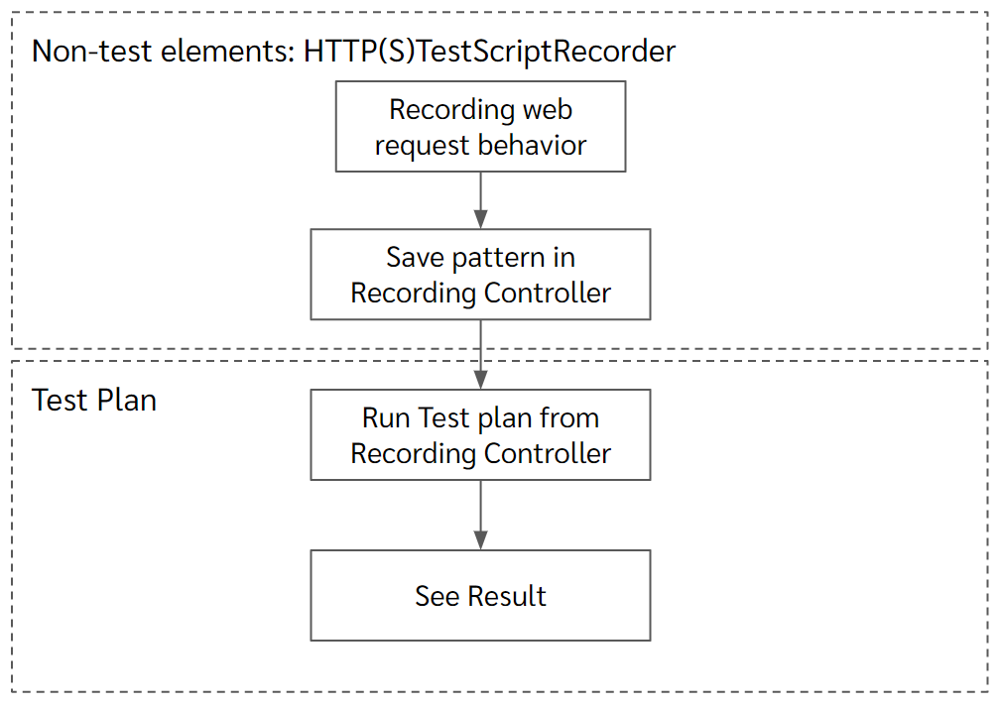
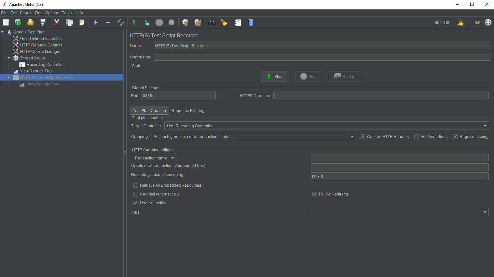
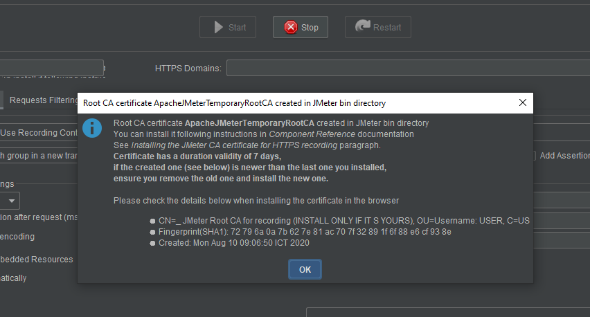

กลับมาตามคำสัญญา ภาค 2 ของ JMeter: Performance Testing Tool ตามแผนเราตั้งใจจะรุมยำ server ว่าจะไหวไปสักกี่น้ำ แต่ก่อนจะกระหนำยิง เราต้องมีรูปแบบการใช้งานที่สมจริงเป็นต้นแบบซะก่อน ซึ่ง JMeter เองมีตัวช่วยให้เราสร้าง test plan อย่างว่องไวได้ด้วยการบันทึกรูปแบบการท่องเว็บด้วย Recording Template

## JMeter Series:
1. [Intro to JMeter ทำไมใครๆบอกว่าง่าย](https://saintsitive-dev.github.io/2020/08/12/jmeter-1/)
2. Recording Template บันทึกรูปแบบการท่องเว็บไว้ยิงรัวๆ
3. Work in Progress..

## เนื้อหาในบทความ

1. [สร้าง Recording Template](#recordingtemplate)
2. [เริ่มต้นบันทึกรูปแบบการท่องเว็บ](#recoding)
    1. ตั้งค่า Browser ให้ส่ง HTTP protocol ผ่าน Proxy Server
    2. ตั้งค่า SSL Certificate
3. [ตรวจสอบ และบันทึก testplan.jmx](#validate)

*การทดลองมีความเสี่ยง ผู้ทดลองโปรดใช้วิจารณญาณในการรับชม*

----

## <a name="recordingtemplate">สร้าง Recording Template</a>

ก่อนจะรันเทสบนเว็บเป้าหมาย เราต้องมี test plan กันก่อนเพราะฉะนั้นเปิด JMeter GUI ขึ้นมา

**เลือก Files > Templates... > Recording**


มันมี 2 เหตุผลที่เลือก Google เป็นเป้าหมายในวันนี้ 

1. ขอสารภาพว่าป็อด 5555 ไม่กล้าเอาเว็บบริษัทมาเป็นตัวอย่างจริงๆค่ะ คือมัน scale out ได้แหละ แต่ก็อย่าเลย เราเล่นกับ google นี่แหละ
2. google.com เป็นบรรทัดฐานที่ดีค่ะ ผลลัพท์ที่ได้จากการยิงเว็บที่รับมือคนได้ทั้งโลกระดับนี้ จะเป็น benchmark ที่ดีเวลาเอามาเทียบกับเว็บของเรา

หลังกด Create สิ่งที่ได้มาจะเป็นดังรูปข้างล่าง


[บล็อคที่แล้ว](https://saintsitive-dev.github.io/2020/08/12/jmeter-1/)อธิบายอย่างนึง ทำไมมาทำจริง test plan เปลี่ยนเป็นอีกแบบนึง 5555 ใจเย็นๆนะทุกคน มันยัง concept เดิมแหละ ใน**กรอบสีเขียว** Thread Group > Elements(Recording Controller) > Listener(View Results Tree)

แล้วข้างบนอีก 2 ก้อนสีที่งอกมามันคืออะไรกันละ!!

มาว่ากันที่**กรอบสีแดง**ก่อน User Defined Variables, HTTP request Defaults, HTTP Cookie Manager ทั้ง 3 อันนี้เป็น Config elements มีมาเพื่อประกาศตัวแปร/ตั้งค่าทั่วไปให้ test plan หรือกำหนดค่า default สำหรับใช้ใน test plan หนึ่งๆค่ะ เช่น เราสามารถเอาค่า host ใน User Defined Variables ไปใช้ในจุดอื่นๆของ test plan ได้ในลักษณะนี้

``` java
${host}
```
ช่องนั้นก็จะถูกแทนค่าด้วย www.google.com ทันทีที่ runtime ซึ่งไม่ค่อยมีประโยคกับการรันเทสก็อกๆแก๊กๆของเราเท่าไหร่ค่ะ แต่มีคุณประโยชน์มหาศาลหากเราจะเอาไปใช้ใน Production และแน่นอนว่า มีอีกหลาย Config elements ให้เราใช้งาน แล้วแต่ use case ที่ต้องการเทส

**กรอบสีฟ้า** ถ้ายังจำได้จากบล็อคที่แล้วมีการพูดถึงคอนเซป workbench (ที่ไม่มีอีกต่อไปแล้วในเวอร์ชั่น 5.3) มันคือการทำงานที่อยู่นอก test plan นึกภาพ flow ของสิ่งที่เรากำลังจะทำในตอนนี้คือการทดสอบยิงเว็บของเราแบบมีลำดับ action โดยทั่วไป Test plan ต้องการข้อมูลแค่ **ยิงไปไหน ปริมาณเท่าไหร่ ลำดับเป็นยังไง** การได้มาซึ่งข้อมูลเหล่านั้นคือการนั่งสร้าง test plan elements มาประกอบทีละอันๆ

แต่ไม่ ครั้งนี้สิ่งที่เราจะทำคือการวานให้ JMeter บันทึกรูปแบบการเดินทางท่องเว็บของเราให้หน่อย แล้วเราจะเอาลำดับที่ได้นั้นไปเป็น elements ต่างๆของ test plan อีกที

เพราะฉะนั้น เรื่องราวของการตั้งค่าเพื่อบันทึกการเดินทางครั้งนี้ จึงไม่ถือเป็นส่วนหนึ่งของ test plan และจะไม่ถูกเรียกใช้เมื่อเราสั่งรันเทสค่ะ ถ้างง ดูรูปประกอบค่ะ



### เพราะทุกครั้งที่รันเทส เราไม่จำเป็นต้องบันทึก behavior ใหม่ แค่รันตาม behavior pattern เดิมที่เรามี 100 รอบ 1000 รอบก็พอ

-----

## <a name="recording">เริ่มต้นบันทึกรูปแบบการท่องเว็บ</a>

**เลือก HTTP(S) Test Script Recorder**



จะเห็นปุ่ม Start ถ้าใจร้อนกด Start แล้วไปเปิด browser เล่นเว็บเป้าหมาย แล้วหวังว่า JMeter จะ record ให้เลยก็จะผิดหวังค่ะ 5555 (เราทำมาแล้ว บอกแล้วเป็นสายลองก่อน ไม่ได้ค่อยถอยกลับมาอ่าน)

มันมี 2 อย่างที่เราต้อง setting เพิ่มเติมเพื่อให้ JMeter ทำงานได้

1. ตั้งค่าให้ browser ส่ง HTTP package ผ่าน Proxy Server
2. ตั้งค่า Certificate ให้เว็บปลายทาง handshake กับ browser ของเราที่ถูกดักผ่าน proxy server แล้วยังผ่าน (เพราะเราคุยกันกับเว็บปลายทางด้วย HTTPS protocols)


เพราะเราต้องการบันทึก pattern ของการยิง http request เอาไว้ลูปใส่ server เป้าหมายในภายหลัง จึงต้องทำให้ JMeter อ่าน http package ที่เดินทางเข้าและออกจาก browser ที่เราเปิดเว็บเป้าหมายได้ ถ้าใครเคยเล่น wireshark จะเข้าใจว่ามันคือหลักการเดียวกันค่ะ

*และปุ่ม Start ที่เห็นใน Configuration ของ HTTP(S) Test Script Recorder นั้น คือการสั่งเปิด proxy server เพื่อดักจับ package ค่ะ*

และนอกจากนี้จะส่วนให้ config เพิ่มเติมอีก 2 ส่วน 

**Test Plan Creation** ตรงนี้คือตัวกำหนดว่าจะเราจะบันทึก pattern ที่ได้ไปไว้ที่ไหนของ test plan, จะแบ่งกรุ๊ปของ Sampler (transactions) ด้วยอะไร

**Requests Filtering** ระหว่างที่เราทำการบันทึกมันอาจมี package อื่นปลอมปนเข้ามา เช่น chrome ของเราเอง มีการ login ค้างเอาไว้ดังนั้นจะมี package ที่ยิงไป googleapis อยู่เสมอ เราสามารถกรองของแบบนี้ออกได้

### 1. Setting browser & Proxy server

*browser ที่เลือกมาเป็น Chrome ค่ะ*

**เลือก Settings > Advanced > System > Open your computer's proxy settings**

**เลือก Use a proxy server**

**ใส่ Address เป็น http://localhost**

**ใส่ Port เป็น 8888 (ตรงกับ port ใน HTTP(S) Test Script Recorder)**

Save ปั๊บ เน็ตหลุดปุ๊บค่ะ 555 เพราะเรายังไม่ได้ start proxy server เลย

### 2. ตั้งค่า Certificate

**กด start ใน HTTP(S) Test Script Recorder จะเจอ popup หน้าตาแบบนี้**



ทันทีที่กด start เราจะได้ CA certificate มา 1 อัน อยู่ใน folder bin เราต้องเอาสิ่งนี้ไป import ให้ browser เราอีกทีค่ะ

**เลือก Settings > Privacy and security > Security > Manage certificates**

**เลือก tab Trusted Root Certificate Authorities > Import > เลือกไฟล์ ApacheJMeterTemporaryRootCA.crt**

**Restart Chrome**

cert ตัวนี้มีอายุเพียง 7 วัน และเมื่อหมดอายุต้องเอาออกก่อนจะใส่ตัวใหม่ลงไปเสมอ ไม่งั้น browser เบลอ

เพียงเท่านี้เราก็พร้อมแล้วที่จะ record การเล่นเว็บของเรา

### 3. Start Proxy Server และเริ่มท่องหน้าเว็บเป้าหมายจนกว่าจะพอใจ

ในขั้นตอนนี้ เราทำ 2 อย่างค่ะ
1. เข้าหน้า www.google.com
2. พิมพ์ jmeter ในกล่อง search แล้วค้นหา

### 4. Stop

สิ่งที่ได้ออกมามี 2 ส่วนนะคะ

### ส่วนที่ 1

HTTP request ทั้งหมดที่ record ไว้ระหว่างเปิด proxy server จะถูกบันทึก pattern ไว้ใน **Thread Group > Recording Controller** ภายใต้ recording controller จะมี transaction controller นี่คือการพยายามจัดกรุ๊ปของ http request transaction 


สีฟ้าอันแรก - GET request www.google.com
สีฟ้าแผงที่สองและสาม - GET request ตอนที่พิมพ์ jmeter แบบรายตัว
สีแดง - GET request ผลลัพท์การเซิส jmeter

ส่วน transaction ล่างที่ไม่ได้กล่าวถึงอันนั้นเป็นส่วนที่เรา login google account ไว้และไม่เกี่ยวกับการทดสอบของเราวันนี้

### ส่วนที่ 2

google-recording.xml ไฟล์นี้คือผลลัพท์ของการรันรอบนี้ สามารถดูได้ที่ **HTTP(S) Test Script Recorder > View Results Tree > Write result to file / Read from file**

อันนี้เป็นตัวอย่างผลจากการรันทดสอบภายใต้ Thread Group 1 concurrent/1 loop เท่านั้น ขนาดไฟล์ก็ปาไป 1 Mb คือเก็บละเอียดมากค่ะ ลองเปิดดูได้

ซึ่งเวลาเอาไปรันจริง แนะนำว่าให้บันทึกไฟล์ลงในไดร์ฟที่ว่างนะคะ เพราะเราต้องใช้ไฟล์นี้แหละในการ generate ผลลัพท์รูปแบบต่างๆ

และด้วยความที่บันทึกละเอียดขนาดนี้ จึงไม่แนะนำให้ใช้ View Results แบบใดใดเลยระหว่างที่ทำการรันเทส

และยิ่งแผนเราจะยิง 1000 concurrent ไม่ควรอย่างยิ่งที่จะใช้ GUI เพราะถ้าเรา process response ที่ server ตอบกลับมาไม่ทัน write file ได้ช้า จะทำให้ผลการวัด performance คลาดเคลื่อนไปเลยด้วยค่ะ

---

## <a name="validate">ตรวจสอบ และบันทึก testplan.jmx</a>

**คลิกขวาที่ Thread Group > Validate** เพื่อตรวจสอบดูว่ามีข้อมูลส่วนไหนที่เวลาเอาไปรันแล้วจะไม่ได้ผลเหมือนที่ทำการบันทึกไว้รึเปล่า บอกเลยว่า ถ้าถึงเวลาไปรันบนเว็บจริงของเราที่มีระบบ authentication จะมีประเด็นค่ะ เพราะ Recording จับไว้ และเอามาใช้ต่อได้เฉพาะ token ที่เห็นติดมากับ package เท่านั้น เพราะฉะนั้นแนะนำให้ login ใหม่ไปเลยระหว่าง record นะคะในคราวนี้

หลังจากนั้นค่อย implement User Defined Variables, Pre/Post Processors เพื่อกระทำการขอ token แทนการ login ในอนาคตค่ะ

แต่สำหรับ google search ครั้งนี้คือผ่านค่ะ save ได้

**เลือก Test plan > Files > Save**

จากนั้นไปนอนค่ะ 5555555555

----

ยังเหลืออีก 1 ตอนนะคะ สำหรับซีรี่ย์ JMeter จากเดิมกะว่า 2 ตอนจบ ไม่ได้จริงๆค่ะ รายละเอียดมันเยอะเกินไป ไม่เพียงแค่คนอ่านจะย่อยไม่ไหว เราเองก็ขยายให้ฟังได้ไม่หมด

นี่ยังไม่ได้พูดถึงการใช้ Pre processors / Post processors / Timer / Assertion และอีกล้านแปดที่ยังมีอีกเพียบใน JMeter ซึ่งเราเองก็ยังอ่านไปไม่ถึงไหนค่ะตอนนี้

พอดีมีเป้าหมายว่าต้องเทส Performance เว็บตัวเองให้ได้ เลยเอาแค่เท่าที่ต้องการก่อน ซึ่งตอนนี้ก็ได้ผลนั้นออกมาแล้ว ไว้จะเอา result มาเทียบกับผล google คราวนี้ในบล็อคหน้านะคะ

## มันก็จะเขินๆกับผลลัพท์นิดนึง 55555