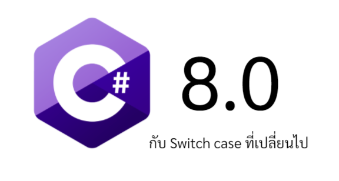
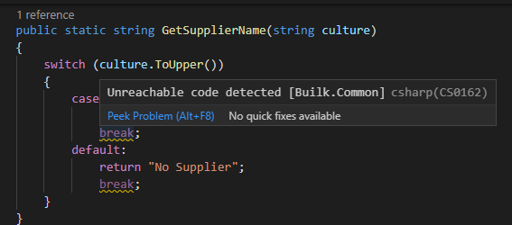

เรื่องมันเริ่มมาจาก เมื่อคืนลง extension ใน visual studio code แล้วพบว่า warning งอกทั่วทุกหัวระแหงก่อนจะค่อยๆ rebuild แล้วกลับเป็นปกติยกเว้นบางไฟล์ที่ยังแดงเถือกไม่หาย และ 1 ในนั้นก็พาให้เราไปเจอกับ code ชุดนึงเข้า



## มีคนวาง break ไว้หลัง return

ใจดำอำมหิตอะไรเยี่ยงนี้ 5555 break จะไม่มีวันได้เห็นเดือนเห็นตะวัน ไม่มีวันได้สัมผัสการ debug ใดใด เพราะ cursor ทั้งหลายจะโดน return ดีดออกจาก method ไปจนหมด

### แต่ก่อนจะใจบุญลบ code ออกไป สมองดันสงสัยซะก่อน

แต่ switch case มันใช้กับ break และ default นี่หว่า 4 สหายที่ใช้กันมาแต่โบราณกาล แล้วถ้าไม่มี break ทิ้งไว้แค่ return มันก็ได้แหละ แต่ทำไมมันรู้สึกขัดใจแปลกๆวะ หรือเพราะมันทำงานคนละอย่างกัน...

*(สาระ - break จะดีดเราออกจาก switch case แล้วไปต่อบรรทัดล่างของ method นี้ ในขณะที่ return จะดีดเราออกจาก method ไปเลย)*

งั้น use case ที่ใช้ switch case + return นี่มันใช้กับอะไรละเนี่ย พอสงสัยก็เลยเริ่มเซิสค่ะ แต่พอเซิสกลับพบว่ามันมีรูปแบบการเขียน switch case ใหม่ๆโผล่มาอีกมากมาย และจุดเปลี่ยนล่าสุดแห่งวงการ switch case ก็เป็น feature ที่เปิดกว้างให้ concept ของ switch case มีความเหมาะสมกับการใช้งานหลากหลายมากขึ้น ซึ่งมาพร้อมกับ C# version 8.0 ที่เพิ่งจุดระเบิดเปิดตัวไปเมื่อไม่นานนี้เอง

## From Statement to Expression

ใน C# version ใหม่ จริงๆมีหลาย feature แต่ที่อยากพูดถึงก่อนก็คือ switch case

อยากที่เกริ่นไว้ ปกติเราใช้ switch case คู่กับ break มาจนเป็นธรรมชาติ แล้วถ้าไปอ่าน [doc](https://docs.microsoft.com/en-us/dotnet/csharp/language-reference/keywords/switch) ของมันก็จะพบแมสเสจบางอย่างที่ก่อให้เกิดความสงสัย (คนอื่นอาจรู้อยู่แล้ว 555)

> switch is a selection statement...

>The switch statement is often used as an alternative to an if-else construct...

ขีดเส้นใต้ตรง statement

พอลองเซิสต่อไป ก็ย้อนกลับไปถึงคำนิยามของ **Statement ใน C# ว่ามันคือ กลุ่มก้อนของ keywords (codes) ที่ก่อให้เกิด action อาจจะมีหรือไม่มี expressions และ operators ก็ได้**

**และ expression เป็นซับเซตของ statement แต่เป็น action ที่มีการคำนวณ หรือทำอะไรบางอย่างให้เกิด value และมีการเก็บลงในตัวแปร**

ถ้างง ดูตัวอย่าง code ดีกว่า

```C#
int cats; //statement (declaration statement)
cats = 2; //ก็ยัง statement
cats++; //เนี่ย EXPRESSION statement มีการ + แล้วเก็บลง cats
```

และ switch case ดั้งเดิม เกิดมาพร้อมคำนิยามว่าเป็น **statement** นั่นหมายความว่าเราสามารถใช้ switch case เพื่อส่ง value บางอย่างกลับ (return) หรือแค่ให้เข้ามาทำงานบางอย่างแล้วผ่านไปโดยไม่ส่ง value อะไรกลับก็ได้เช่นกัน (break)

## แต่พอมาถึง C# 8.0 ในรายการ feature ใหม่มีสิ่งที่เรียกว่า [switch expression](https://docs.microsoft.com/en-us/dotnet/csharp/language-reference/operators/switch-expression)

ของเดิมก็ทำได้อยู่แล้ว ดังนั้นคราวนี้จึงเป็นการปรับ syntax ใหม่เพื่อให้เราเห็นความแตกต่างระหว่าง case ได้ง่ายขึ้น

``` c#
            string statusDisplay;
            switch (projectStatusId)
            {
                case (int)ProjectStatus.Active:
                    statusDisplay = "Working";
                    break;
                case (int)ProjectStatus.Finished:
                    statusDisplay = "Finish";
                    break;
                case (int)ProjectStatus.Terminated:
                    statusDisplay = "Terminated";
                    break;
                case (int)ProjectStatus.Pending:
                    statusDisplay = "Pending";
                    break;
                default:
                    statusDisplay = "Not supported status id";
                    break;
            };
            return statusDisplay;
```

สามารถเปลี่ยนใหม่ให้สั้นลงได้เป็นแบบนี้

``` c#
            projectStatusId switch {
                ProjectStatus.Active     => return "Working",
                ProjectStatus.Finished   => return "Finished",
                ProjectStatus.Terminated => return "Terminated",
                ProjectStatus.Pending    => return "Pending",
                _ => throw new ArgumentException(message: "Not supported status id")
            };
```

1. การเอา case : ออกไปแล้วใช้ => แทน
2. การเอา default ออก เหลือแค่ _
3. การสลับ match มาวางหน้า switch

ทั้งหมดทั้งมวลมันทำให้เกิดการจัดวางบรรทัดแบบใหม่ที่ส่งผลให้เราอ่าน code และเห็นผลลัพท์ที่จะได้จาก case ต่างๆง่ายขึ้นมาก สมแล้วที่ทาง C# 8.0 เคลมว่าเป็น feature ที่เพิ่มเติมความพิเศษให้ switch case พร้อมเป็น Expression statement อย่างสมศักดิ์ศรี

นอกจากนี้ก็ยังมีวิธีการเขียน switch case เพิ่มเติมใน version นี้อีกหลายรูปแบบ แนะนำให้เข้าไปลองอ่าน document ต้นทางกันดู*แล้วจะรู้ว่า switch case เป็นได้มากกว่าที่คุณคิด* :wink: