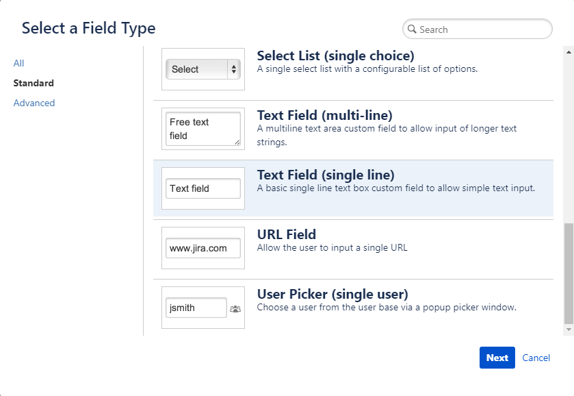

## ที่ออฟฟิศใช้อะไรจัดการงาน develop กันคะ

สำหรับ Builk One Group เราถนัดใช้ JIRA Cloud และวันนี้ จะพาทุกคนทัวร์ระบบรับแจ้งบัค/แจ้งปัญหาการใช้งานแอพพลิเคชั่นโดยใช้ JIRA เพียวๆไม่พึ่ง code กันค่ะ


JIRA จากตระกูล Atlassian (เจ้าของเดียวกับ Bitbucket) เป็น Solution สำหรับบริหาร+จัดการการพัฒนา Software ในรูปแบบ Agile ที่พาวเวอร์ฟูลตรงที่สามารถสร้าง workflow ได้ดั่งใจปรารถนา (ก็ยังไม่ค่อยเจอข้อจำกัดนะคะ มีทรมานนิดหน่อยตอนที่ย้าย JIRA Cloud 2 organization มารวมกันเป็นอันเดียว) ล่าสุดก็ควบรวม Trello ไปแล้ว ก็แฮปปี้สำหรับคนใช้ Kanban สุดๆไปเลย

เอาละเข้าเรื่องของเราดีกว่า

เนื่องจากได้รับโจทย์ให้ทำระบบ Ticket issuing หรือก็คือระบบแจ้งปัญหาการใช้งานที่สามารถฝังตัวเองไว้ในหน้าเว็บได้ แต่ถ้าคุณโทรมาใน 30 นาทีนี้ เราแถมให้ไปเลย ระบบตอบกลับความเคลื่อนไหวทางอีเมล ฟรี!

ขอเล่าถึงที่มาว่าทำไมถึงใช้ tool นี้นิดนึงก่อนเข้า tutorial นะคะ ใครไม่สนใจ อยากดู tutorial แล้ว ข้ามเส้น __ ไปได้เลย

------------------

เมื่อนานแสนนานมาแล้ว เคยทำระบบเก็บบัคด้วย JIRA Issue Collector ฝังไว้หลังบ้านให้ usercare ที่ทำหน้าที่ซัพพอร์ตลูกค้าได้ใช้งาน เพราะย้อนกลับไป 8 ปีก่อน JIRA เหมือนป่าดิบชื้นค่ะ ไม่เป็นมิตรต่อสายตาของสายอาชีพอื่นอย่างมาก เรียกได้ว่าเข้ามาทางไหนก็หลง ตอนนี้คิดว่าดีขึ้นเยอะแล้วนะ 5555

แต่ไม่ว่าจะหลงยังไง เวลามีบัคมา เขาเหล่านั้นก็ยังต้องแจ้งเราอยู่ดี แล้วที่ที่เราเหล่าเดฟอาศัยอยู่ก็คือใจกลางป่าดิบชิ้น JIRA scrum board นั้นน่ะเอง ถ้าใครเคยใช้จะรู้ว่าเมื่อก่อนกว่าจะเข้าไปถึงจุดนั้นได้คือผ่านหลายคลิกมาก

สุดท้ายเลยตัดสินใจทำทางเข้าไว้ให้เข้าถึงได้ง่ายด้วย JIRA Issue Collector ซึ่งเป็น feature นึงที่มีอยู่ใน Project classic type เท่านั้น (ยังไม่ได้เช็คว่า new gen จะทำมั้ย แต่ภาวนาขอให้ทำ) แล้วเอา code ที่ได้ไปฝังไว้ในเว็บเพื่อให้คนแจ้งบัคใช้งาน

ทีนี้คนแจ้งก็สามารถกด float tab แจ้งบัคจากในเว็บ กรอก field ต่างๆใน popup ที่เด้งขึ้นมาแล้วส่ง card ให้คนที่สิง backlog เห็นได้ทันท่วงที

## ตรง requirement เด๊ะ

และไม่นานมานี้ เราได้สังเกตเห็นปุ่มนึงโผล่ขึ้นมาใน JIRA เป็นรูปสายฟ้า พอลองเล่นดูก็พบว่า อ่อ มันคือ automation rules ที่สามารถใส่เพิ่มได้แบบสะดวกมาก อิจฉาคนใช้งานสมัยนี้จริงๆ 555555

(ยังจำภาพความลำบากเมื่อก่อนที่ต้องผสมผสาน workflows+notification scheme เพื่อจะส่งเมลแบบเดียวกันเนี่ยแหละได้เป็นอย่างดี)

งั้นเราจะรับบัคมาอย่างเดียวทำไม ก็ออกแบบให้พอแก้เสร็จก็แจ้งกลับได้อัตโนมัติกันไปเลยดีกว่า!

---------------

## 1. สร้าง field Email
งงละสิ ทำไมสร้าง Field อีเมลก่อน มันค่อนข้างเป็นหลักการ programming นิดนึง ในทางโปรแกรมเมอร์เราเรียกกันว่า *การประกาศตัวแปร* (เพื่อจอง memory เอาไว้ใช้)

ซึ่ง field Email นี้เราเตรียมจะเอาไปใช้ใน form ที่จะให้ user กรอกในภายหลัง ดังนั้นเราเลยจะสร้างเตรียมไว้ก่อน (จริงๆสร้างทีหลังก็ได้ แต่ก็ต้องกลับมาแก้ไข form ใหม่อีกรอบ)

และแน่นอน field นี้สามารถเอาไปใช้ได้อีกหลายโปรเจค และจะสร้างอีกกี่ field ก็ได้ตามอัธยาศัย

### **ไปที่ JIRA Settings > Issues > Custom fields > Create custom field** 



เลือก Text Field (single line) แล้วกรอกชื่อ field ไว้ว่า Email

## 2. ใส่ field ที่สร้างใหม่ให้โปรเจค

### **ไปที่ Custom fields > เลือก field ใหม่ที่เพิ่งสร้าง > ... > Associate to Screens ** 

ติ๊กเลือกโปรเจคที่ต้องการสร้างระบบ Issue Collector กด update ที่ท้ายหน้าจอด้วยนะคะ 5555 โปรเจคเราเยอะมากจนลืมกด update แล้วก็มานั่งงงว่าทำไมมันไม่เปลี่ยนวะ? เป็นประจำ 

ฝันให้ Jira มี autosaved แต่ก็ยังไม่เป็นจริง...

## 3. Setting JIRA Issue Collector

*โปรเจค classic เท่านั้นที่จะมี feature นี้นะคะ*

### ไปที่ Project เป้าหมาย > Project Settings > Issue Collector > Add issue collector


JIRA Issue Collector ประกอบไปด้วย 3 ส่วน
* **Issue Collector Setting** (สีแดง) กางกรอบแดงพลาดค่ะ จริงๆมันเริ่มตั้งแต่ name แหละส่วนแรก จุดสำคัญคือ Reporter ตรงนี้จะกรอกลงไปได้แค่คนที่มี account jira ค่ะ จึงเป็นเหตุให้เราต้องไปสร้างกล่อง email เพื่อรับ email ของลูกค้าเพิ่มเพื่อทำการตอบกลับ
* **Trigger Setting** (สีน้ำเงิน) สามารถปรับแต่งการแสดงผลได้หลากหลายค่ะ ยิ่งถ้าเลือก custom คือแก้ behavior แก้จุดจัดวางปุ่มกันได้เลยทีเดียว
* **Issue Form** (สีเขียว) สามารถเลือกได้ว่าอยากให้คนแจ้งกรอกข้อมูลอะไรบ้าง และที่สำคัญคือสามารถเพิ่มกล่อง email ของเราลงไปได้ และถ้าเลื่อนลงไปท้ายดูในส่วน preview ก็จะเห็นสภาพ form ที่จะโผล่มาให้ผู้ใช้งานกรอกอีกด้วย

สร้างเสร็จแล้วอย่าลืม save

## 4. Setting JIRA Automation Rules

### **ไปที่ Project เป้าหมาย > Project Settings > Automation > Create rule**


บอกเลยว่า endless possibilities ค่ะ 55555 (มี incoming webhook ด้วย คือสบายใจละ)

แต่ flow ของเราครั้งนี้จะลองทำอย่างง่าย rule เดียวก่อน คือเมื่อปัญหาแก้เสร็จเรียบร้อยค่อยส่งเมลแจ้ง

1. เลือก Issue transitioned
2. เลือก To สถานะ Done
3. เลือก New Action > Send email


มาถึงตรงนี้จะ tricky นิดนึงค่ะ

ช่อง To เนี่ย ถ้าเลือกไปมันจะไม่มีกล่อง Email ที่เราสร้างมาใหม่ แต่เราสามารถเอาค่าจาก custom fields มาใส่ได้โดยการใช้ feature *smart value* {{ใส่ชื่อฟิลด์เก็บค่าที่อยากได้ในวงเล็บ}} แต่ลำบากนิดนึงค่ะ คือต้องเอา custom field ID มาใส่ในรูปแบบนี้

```
{{issue.customField_xxxxx}}
```
ไหนบอกไม่มี code 5555 นิดนึงอ่ะเนอะ

แล้วจะไปเอา ID นั้นมาจากไหน ให้กลับไปที่หน้ารวม Custom fields ของเราที่ JIRA Settings > Issues > Custom fields > field เป้าหมาย > ... > Edit Custom Field Details


นั่นแหละไอดีของ field ของเรา ย้อนกลับไปเติมเต็มข้อมูลให้เรียบร้อยแล้วลองทดสอบการใช้งานดูได้เลยค่ะ


ก่อนส่งให้ลูกค้า อย่าลืมปรับหน้าตาอีเมลกันนะคะ ^^