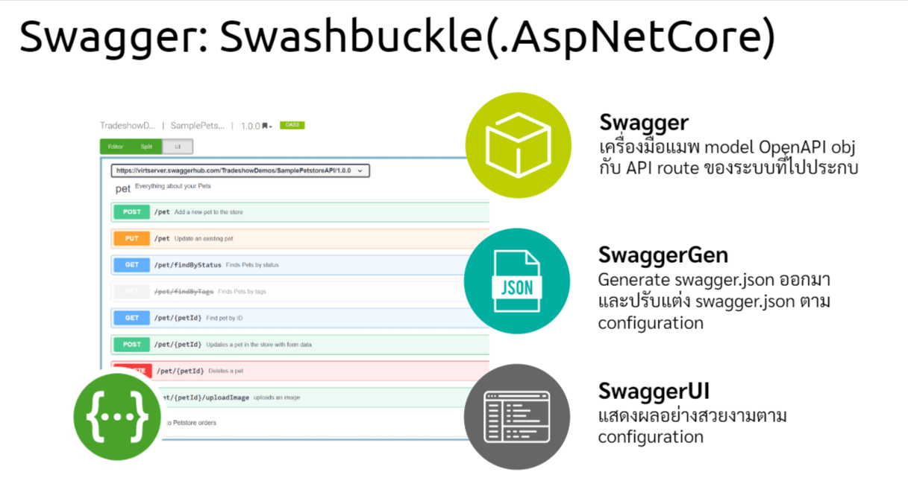
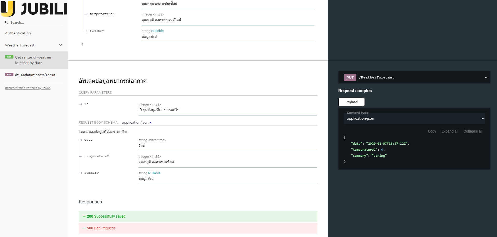

## มือก็ต้องเกี่ยวข้าว(coding) เท้าก็ต้องไกวเปล(documenting that sourcecode)

ใครเป็นเดฟคงรู้ดีว่าชีวิตนี้มันปวดร้าว ที่ไหนมีทีม SA เราชาวเดฟยังพออาศัยพึ่งพาให้ผู้กล้าเหล่านั้นช่วยดูแล Technical document ทั้งหลายได้บ้าง แต่สำหรับทีมเดฟล้วน ที่ต้องทั้งเขียน code แล้วยังต้องมาดูแล Technical document ด้วยนั้น

### บอกเลยว่า Trilogy แถม Drama Comedy สุดๆ

จะไม่ทำก็ไม่ได้… แถมพอทำไป requirement ก็ยังเปลี่ยนแปลงให้ต้องกลับมาแก้กันอยู่ตลอดๆ แอพก็เหมือนเด็กที่ต้องมีวันเติบโต ต้องเปลี่ยนแปลงตามกาลเวลา ตามเทคโนโลยีที่เปลี่ยนไป ตามธุรกิจที่ต้องปรับตัว เพราะงั้นต่อให้ทำแอพมาดีแค่ไหน ก็ไม่มีแอพใดที่อยู่ได้ค้ำฟ้า
ทางออกที่พอรับได้สำหรับเดฟปากกัดตีนถีบก็คงจะหนีไม่พ้น..

## Living Document
***Technical Document ที่เปลี่ยนแปลงตามระบบที่เปลี่ยนไปอยู่ตลอดเวลา***

สมัยเรียนหลายคนคงเคยชินกับวิชา SA ที่จัดให้เรียนพร้อมๆกับวิชาโปรเจค และ 2 วิชานี้ก็จะบูรณาการกันในเทอมนั้น วิชานึงส่งรายงาน Technical Specification อีกวิชาพรีเซนโปรแกรม และนั่นคือตัวอย่างของการทำ spec ชิ้นแรกที่พอทำเสร็จก็ไม่ได้กลับไปมองอีกเลย

แต่ในหลายองค์กรที่เดฟหลายคน จากหลายทีมต้องทำงานร่วมกัน บางครั้งแค่ code มันไม่พอ มันจำเป็นที่จะต้องมีเอกสารประกอบที่สามารถอธิบายที่มาที่ไปของ code ชุดนั้นได้ หลายทีมพึ่งพา Wikipedia และหลายทีมก็ทำเว็บขึ้นมาเอง

แต่ที่ถือว่าเปลี่ยนแปลงโลกของเดฟไปสู่มิติแห่งการเขียน spec คือการมาถึงของ XML (Extensible Markup Language) โดยองค์กร W3

ความสามารถหลักๆคือการต่อขยายจาก programming language ใดก็ได้ เพราะทุก Compiler มีหน้าที่ที่ต้องอ่านมันออก และยังสามารถปรับโครงสร้างของตัวเองเพื่อรองรับการสื่อสารระหว่างระบบโดยเฉพาะ
และแน่นอน C# ก็ adopt สิ่งนี้มาใช้ในระบบให้เราสามารถใส่ XML comment ในจุดใดของโปรแกรมก็ได้ และยัง export ออกมาใช้งานได้สะดวกทุกครั้งที่มีการ Build โปรแกรมใหม่

สังเกตเห็นอะไรมั้ยคะ…

## export XML comment ทุกครั้งที่มีการ Build โปรแกรมใหม่

นั่นหมายความว่าเราจะมีเสป็คใหม่ทุกครั้ง ถ้าเราขยันขันแข็ง maintain comment ที่กระจายอยู่ทั่วโปรแกรม

## และเมื่อรวมมันเข้ากับ Swagger ละ…

(Swagger Specification หรือ OpenAPI Specification คือเครื่องมือที่สามารถสร้างไฟล์ JSON จาก API Route เพื่อทำเป็น API Document ได้ อีกหนึ่งเทคโนโลยีที่ใช้ทำ Living Document)
_______________________________

เป็นที่มาของสิ่งที่เราจะทำกันในวันนี้ค่ะ

|| 
|:--:| 
|*ใหญ่นิดนึงนะคะ เอามาจากสไลด์สอนน้องที่ออฟฟิศ*|

Flow >> หลักการของมันไม่มีอะไรมาก เราจะใช้ swagger.json เพื่อสร้าง API Specification ซึ่งลำพัง Swagger ถือเป็น Living API Documentation อยู่แล้วเพราะจะ generate ใหม่ทุกครั้งที่ build จากนั้นเราจะแล้ว inject XML comment ที่เรา comment ทิ้งไว้ทั่ว code ลงไป

ถ้าถามว่าทำไมต้อง Redoc ก็บอกได้คำเดียวว่าดูแล้วปวดตับน้อยกว่า SwaggerUI เยอะอยู่ค่ะ 5555

## Pre-requisites (ของต้องมีก่อนเริ่ม code)

1. ASP.NET Core API Server (version ไหนก็ได้)
2. Visual Studio Community 2019

สิ่งแรกที่ต้องทำคือการ comment code โดยเฉพาะในส่วน API Controller ที่เราต้องการทำ Spec โดยอย่างน้อยให้ใช้ comment syntax ที่ครอบคลุมข้อมูลดังต่อไปนี้
1. คำอธิบาย 
2. request parameters
3. responses
4. ตัวอย่าง model

## เตรียม XML Comments

API Controller

``` C#
        /// <summary>
        /// อัพเดตข้อมูลพยากรณ์อากาศ
        /// </summary>
        /// <param name="id">ID ชุดข้อมูลที่ต้องการแก้ไข</param>
        /// <param name="weatherForecast">โมเดลของข้อมูลที่ต้องการแก้ไข</param>
        /// <returns>HTTP Status Code</returns>
        /// <response code="200">Successfully saved</response>
        /// <response code="500">Bad Request</response>
        [HttpPut]
        public IActionResult Put(int id, WeatherForecast weatherForecast)
        {
```
Model
``` C#
public class WeatherForecast
    {
        /// <summary>
        /// วันที่
        /// </summary>
        /// <example>3/1/2008 7:00:00</example>
        public DateTime Date { get; set; }

        /// <summary>
        /// อุณหภูมิ องศาเซลเซียส
        /// </summary>
        /// <example>36.6</example>
        public int TemperatureC { get; set; }
```

จากนั้นให้เตรียม export ไฟล์ XML Comment ทุกครั้งที่ทำการ build ดังนี้

|| 
|:--:| 
|*สิ่งสำคัญคือต้อง set ให้หยุดเตือน error 1591 ด้วยนะคะ ไม่งั้นต้องไล่ใส่ XML Comment ทุกที่*|

## Install Swashbuckle.AspNetCore + Redoc

``` PM
Install-Package Swashbuckle.AspNetCore -Version 5.5.0
Install-Package Swashbuckle.AspNetCore.ReDoc -Version 5.5.0
```

## Redoc: Up and running!

Swashbuckle ประกอบไปด้วยการทำงาน 3 ส่วน

|| 
|:--:| 
|*ซึ่งเราจะ replace SwaggerUI ด้วย Redoc*|

จะเริ่มใช้งาน Swagger ต้อง register service ให้กับ API container ของเราก่อนที่ Startup.cs

``` c#
public void ConfigureServices(IServiceCollection services)
        {
            services.AddControllers();
           
            services.AddSwaggerGen();
        }
```
จากนั้นสั่งให้ทำงานเมื่อ runtime จงสร้าง swagger.json ขึ้นมา

``` c#
public void Configure(IApplicationBuilder app, IWebHostEnvironment env)
        {
            if (env.IsDevelopment())
            {
                app.UseDeveloperExceptionPage();
            }

            app.UseHttpsRedirection();
            app.UseSwagger();
            app.UseReDoc(config=> {
                config.SpecUrl("/swagger/v1/swagger.json");
            });

            app.UseRouting();

            app.UseEndpoints(endpoints =>
            {
                endpoints.MapControllers();
            });
        }
```
โดยปกติคำสั่ง UseSwagger() จะทำให้ swagger.json เกิดขึ้นมาที่ default path ../swagger/v1/swagger.json แต่ Redoc มี default URI ของตัวเองที่ ../api-docs ดังนั้นจำเป็นต้อง config path ที่ถูกต้องที่ Redoc จะเข้าถึง swagger.json ได้ ไม่งั้น Something went wrong

ถึงตรงนี้ ถ้าเปิด browser เรียก localhost:port/api-docs ขึ้นมาดูจะเห็น API Document ขึ้นมาแบบเรียบๆ ซึ่งถ้าใช้งานกันภายใน ปล่อยไว้อย่างนี้ก็ถือว่าพอใช้การได้แล้วค่ะ แต่อย่างที่เกริ่นไว้ เราจะเอา comment ที่อุตส่าห์เตรียมไว้ทั่วโปรแกรมมาใช้งานด้วย เพราะงั้น เข้าสู่โซนปรับแต่ swagger.json กันค่ะ

## swagger.json configuration

เป้าหมายของ blog นี้มีอย่างเดียวคือเอา xml comment มาใส่ ง่วงแล้วด้วยค่ะ สำหรับการปรับแต่งอื่นๆ เช่น ใส่ CSS, Authentication ปรับ index.html ขอละไว้โอกาสหน้า(ถ้ามี)

ยังจำได้ path XML ที่เรา export ไว้ได้เนอะ >> bin\redoc-lesson-2.xml

``` c#
public void ConfigureServices(IServiceCollection services)
        {
            services.AddControllers();
           
            services.AddSwaggerGen(config=>{
                var filepath = Path.Combine(AppContext.BaseDirectory, "redoc-lesson-2.xml");
                config.IncludeXmlComments(filepath, includeControllerXmlComments: true);
            });
        }
```
run แล้วเข้าไปยลโฉมอีกครั้งจะได้เห็นอะไรประมาณนี้

|| 
|:--:| 
|*แอบเอา logo ที่ออฟฟิศมาใช้ ไม่ได้ตั้งใจขายตรงจริงๆนะอย่ามองอย่างนั้น ส่วน logo ถ้าอยากใส่ให้ใช้ extension x-logo*|

จบตามเป้าหมาย ไว้พบกันใหม่บล็อคหน้าค่ะ