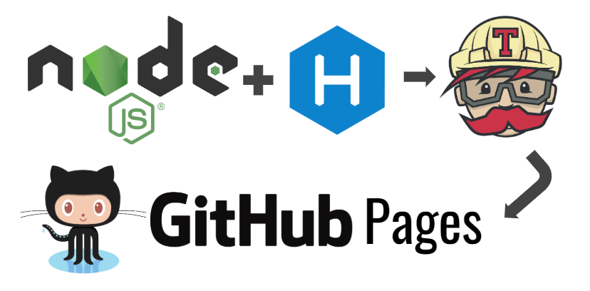
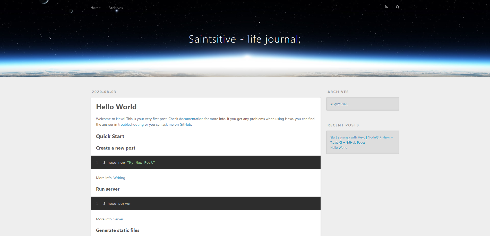

มันเริ่มจากอารมณ์ที่ว่า "อยากจะมี Blog ที่ไม่ใช่ Wordpress/Medium" วันดีคืนดีอยากเปลี่ยนหน้าตาเองอย่างใจก็ทำได้ (แต่ทำมั้ยนี่อีกเรื่อง 5555) โดยมีเงื่อนไขสำคัญอยู่ 2 เรื่อง

### "ฟรี และเป็น markup language"

แล้วจากการที่คุ้นเคยกับการทำ README.md อยู่บ้าง แล้วชอบความซิมเปิ้ลของมันเหลือเกิน เหมาะมาก สำหรับคนที่ code ได้แต่ไม่มีปัญญาเลือกคู่สีอย่างเรา เลยตัดสินใจว่ายังไงบล็อคนี้คงเขียนด้วย markup language ที่เป็น markdown (อย่าเพิ่งงง 555)

เพราะอยากจะเขียนไปเรื่อยๆ แบบไม่ต้องสนใจอะไร อยากใช้ visual code เขียนบล็อค สองเดือนหลังนี้มีอาการตาแห้ง ไม่สามารถจ้องแสงสีขาวของพื้นพลัง Medium ได้นานๆอีกต่อไป แต่ก็คงไม่ได้ทิ้ง Medium นะคะ เผลอๆ บล็อคนี้อาจทำมาเพื่อลองของอย่างเดียวก็เป็นได้ 555 (ล้อเล่นๆ) ไหนๆก็ไหนๆ ฝาก [Medium](https://medium.com/@coalapaparazzi) ไว้ในอ้อมอกอ้อมใจอีกสักอัน

เกริ่นมานาน เข้าเรื่อง geekๆ ของเราดีกว่า
_________________

Stack ที่เลือกมาวันนี้ ตอนแรกว่าจะเล่น Jekyll แต่กลัวโลกไม่จำ เล่น Hexo ที่ไม่ค่อยมีคนใช้นี่ดีกว่าค่ะ 555



เพราะกำลังมองหา Blog Engine ที่รันบน NodeJS ได้ Deploy ง่าย และที่สำคัญคือมี Theme บอกแล้วว่ามันจำเป็นสำหรับคน code ได้แต่ลงสีไม่เป็น เอาละ งั้นเรามาเริ่มลงมือกันเลยดีกว่าค่ะ อยากมี blog ก็เริ่มที่ลง [NodeJS](https://nodejs.org/en/) ลงเสร็จก็ต่อด้วยพระเอกของเรา [Hexo](https://hexo.io/)

### Install Hexo

``` powershell
npm install hexo-cli -g
```

เพียงเท่านี้ก็ได้ Hexo cli มาใช้รันคำสั่งต่างๆของ Hexo งั้นลงมือสร้าง blog แรกกัน หา folder เหมาะๆ แล้วรัน

``` powershell
hexo init <folder>
cd <folder>
npm install
```
ถ้าเข้าไปดูด้านใน จะเห็นโครงสร้างของ blog ดังนี้

```
> node_modules <--- ก้อนนี้เดฟทุกคนรู้จักดี 5555 แต่ไม่ได้เกี่ยวข้องกับโครงสร้าง blog เราในวันนี้ค่ะ
> scaffolds <--- ที่เก็บ template ต่างๆของ post ที่เราสามารถสร้างได้ เราสร้างเพิ่มเองได้เช่นกัน
> source <--- ทุกโพส รวมทั้งรูปประกอบจะกองกันอยู่ในนี้
> themes <--- เปลี่ยน theme ได้ ทำ theme เองมาเพิ่มก็ได้
_config.yml <--- สิ่งอื่นๆที่เป็น configuration ของเว็บ blog และ meta data ของ blog เรา
.gitignore <--- คนใช้ git รู้กันดีว่ามีไว้เมินไฟล์ที่ไม่อยาก push ขึ้น remote
.package.json <--- มีไว้เก็บ version lib ต่างๆที่เราใช้
```
และถ้าเข้าไปดูใน source จะพบว่า Hexo ได้แถมโพสแรกมาให้เราแล้วในชื่อ hello-world.md เพราะฉะนั้นอย่ารอช้า รัน localhost ขึ้นมาดูหน้าตากัน

### Run Hexo on localhost

``` powershell
hexo server
```
็Hexo จะถูกรันขึ้นมาที่ localhost port 4000 จังหวะนี้เปิด browser ดูก็จะเห็น Hexo theme Landscape พร้อม post แรกปรากฎขึ้นมา



พอเห็นบน localhost ก็เริ่มอยากเห็นบน production 5555

อยากได้ url .dev .io บ้าง แต่โอ้โห 40-50 เหรียญต่อปี (นี่แค่ domain ยังมีค่า SSL อีก) เดือนนี้ช็อตจริงๆ คงต้องหาทางฟรีๆ ที่มี .io ให้เราไปก่อน ก็มาพบว่า GitHub มี feature GitHub Pages ที่ให้เดฟ Host scalable web ของตัวเองได้ เพียงแค่ deploy ขึ้นไปไว้ใน branch master ของ repository ที่ตั้งชื่อว่า *username*.github.io

### Create new repository on github

1. สร้าง repository ตั้งชื่อว่า *username*.github.io สำคัญมากที่ต้องตรงกับ username นะคะ
2. push code ของเราขึ้นไปวางบน branch master ก่อนค่ะ มันจำเป็นต้องมี branch master เป็น branch แรก

```
git init
git add .
git commit -m "initial commit"
$ git remote add origin https://github.com/username/new_repo
$ git push -u origin master
```
ถ้าใครใช้ SSH ก็เป็น git@github.com:username/new_repo เอาแทนนะ

### CI/CD to automatically deploy site when changes

ธรรมดาโลกไม่จำ งั้นเราต้องทำ CI/CD มาทั้งทีเอาให้สุดค่ะ 5555

1. 